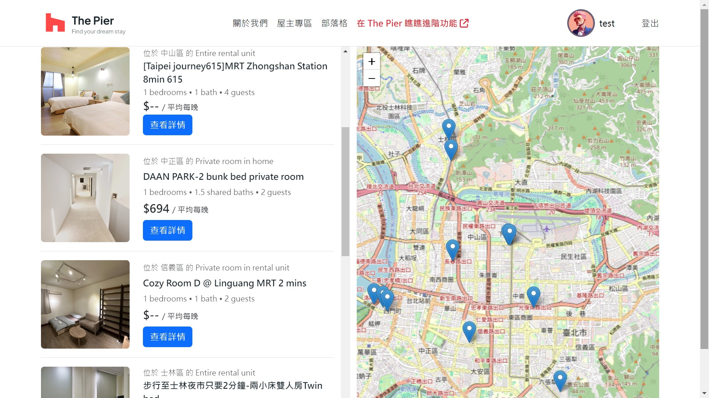
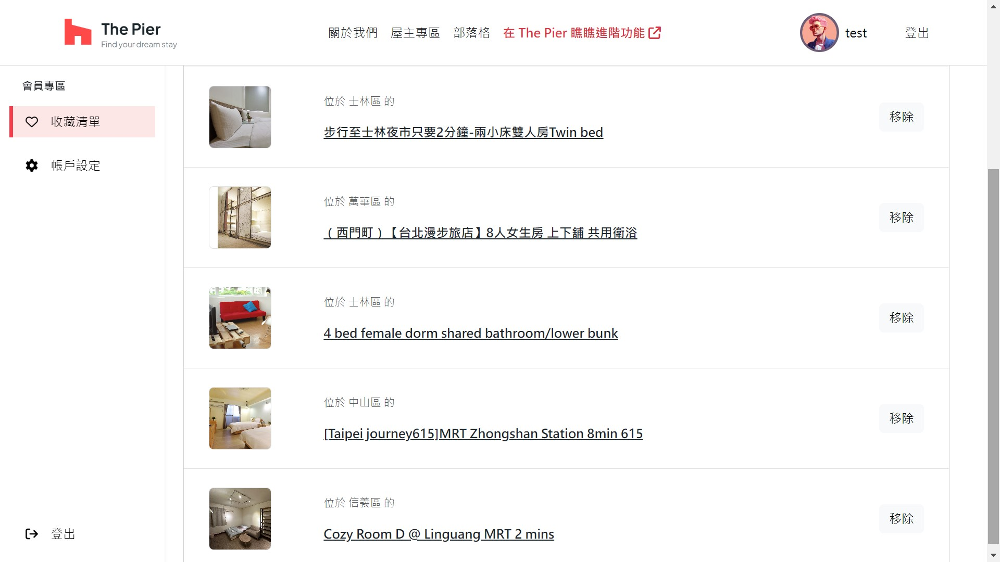
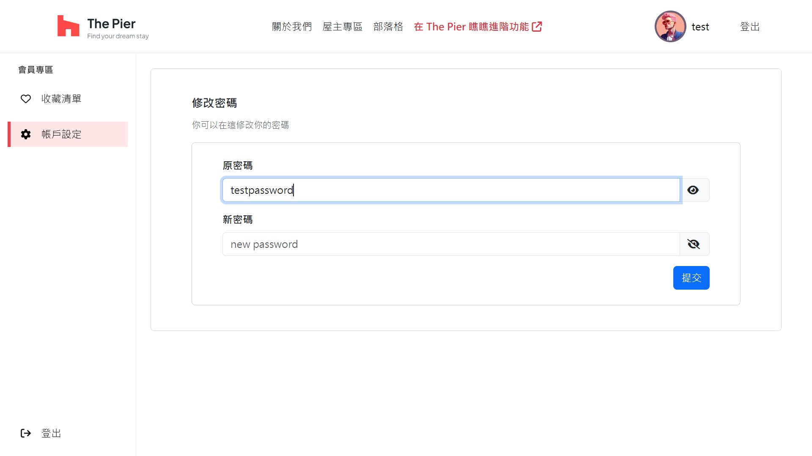
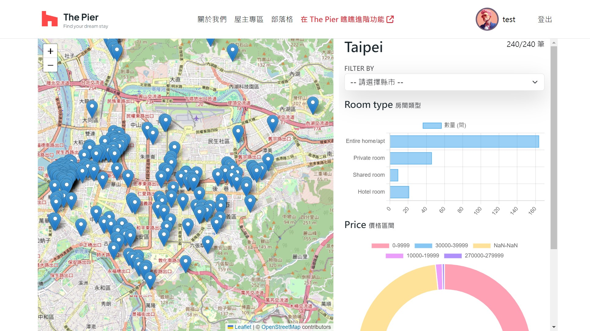
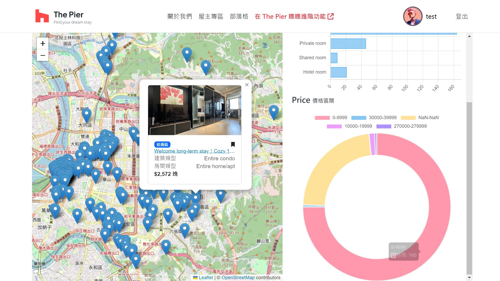

# Airbnb 旅宿評價平台

這是一個 Airbnb 旅宿評價平台，讓消費者能夠查看平台上的住宿資訊，並相互比較住宿選擇。

## 目錄

- [Airbnb 旅宿評價平台](#airbnb-旅宿評價平台)
  - [目錄](#目錄)
  - [背景](#背景)
  - [特性](#特性)
  - [使用技術](#使用技術)
    - [使用套件](#使用套件)
  - [功能截圖](#功能截圖)

## 背景

隨著 Airbnb 市場興起，平台上的住宿也逐漸多元化，專案在於住宿選擇者，提供一個評價平台，幫助使用者找到理想的住宿。

## 特性

- 瀏覽各種住宿地址及資訊
- 住宿評價功能，讓使用者能分享和查看經驗
- 比較不同住宿的功能，幫助使用者選擇最適合的選項
- 使用者登入和註冊系統，提供個性化的體驗
- 高效的搜尋功能，讓使用者輕鬆找到所需的住宿

## 使用技術

- PHP 版本：8.1
- Laravel 版本：^8.75
- 資料庫：MariaDB
- 版本控制：Git
- 容器化：Docker

### 使用套件
- mews/captcha：^3.4
  用於登入功能，生成和驗證 CAPTCHA 的套件
- openstreetdata
- chart.js

## 功能截圖
首頁：支援多重搜尋

搜尋結果頁

會員功能：收藏清單、修改帳戶資訊

進階功能：支援圖表

會員驗證

